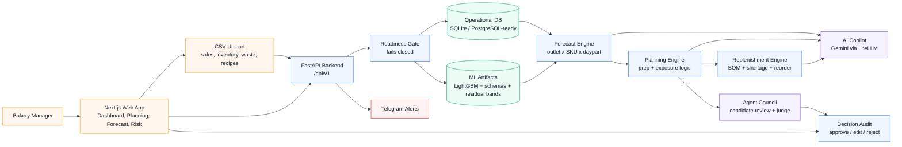

# Predictory

**AI-assisted bakery planning for fresher prep, lower waste, and clearer daily decisions.**

Predictory is a prep and replenishment copilot for bakery-cafe operators. It turns imported POS/ERP-style data into next-day forecasts, prep recommendations, ingredient replenishment needs, waste/stockout alerts, and grounded AI explanations by outlet, SKU, and daypart.

Design principle:

> Forecast with ML. Optimize with rules. Explain with AI. Approve with humans.

## At A Glance

| Area | What Predictory Does |
|---|---|
| Forecasting | LightGBM demand forecasting for outlet x SKU x daypart, with p10/p50/p90 uncertainty bands. |
| Daily planning | Prep recommendations with approval, edit, reject, manager-note, and audit flows. |
| Replenishment | Recipe BOM-driven ingredient need, shortage, reorder quantity, urgency, and driving SKU evidence. |
| Risk center | Waste, stockout, and production-constraint alerts before service begins. |
| AI copilot | Gemini-powered explanations, daily action phrasing, manager note parsing, and Agent Council review. |
| ASEAN readiness | CSV-first onboarding, English/Bahasa Melayu/Simplified Chinese support, and ASEAN currency handling. |
| Notifications | Optional Telegram forecast-summary alerts. |

## Why It Matters

Bakery teams often decide tomorrow's bake plan using spreadsheets, intuition, and yesterday's sales. That creates two expensive failure modes:

- **Overproduction:** stale products, wasted ingredients, wasted labor, and disposal cost.
- **Underproduction:** stockouts during peak demand, lost revenue, and disappointed customers.

Predictory acts as the decision layer between yesterday's operations and tomorrow's bake. It does not replace POS or ERP systems; it helps operators convert their data into concrete, reviewable actions.

## SDG Alignment

| SDG | Predictory Alignment |
|---|---|
| **SDG 12: Responsible Consumption and Production** | Primary alignment. Forecast-backed prep and BOM replenishment reduce avoidable overproduction and ingredient waste. |
| **SDG 13: Climate Action** | Lower food waste can reduce the climate impact linked to wasted ingredients, production energy, transport, and disposal. |
| **SDG 2: Zero Hunger** | Better prep and replenishment planning can reduce stockouts and keep food available more consistently. |
| **SDG 3: Good Health and Well-being** | Freshness-aware planning, inventory visibility, and waste-risk detection support safer food operations. |

## Demo Workflow

1. Import operational CSVs: outlets, products, ingredients, recipes, sales, inventory, waste, weather, and holidays.
2. Check forecast readiness for the selected planning date.
3. Generate a LightGBM-backed forecast run.
4. Review Dashboard and Daily Planning recommendations.
5. Inspect model evidence, uncertainty, waste/stockout exposure, and replenishment needs.
6. Ask Copilot for grounded explanations or parse manager notes.
7. Use Agent Council for one selected recommendation when a deeper review is needed.
8. Approve, edit, or reject prep lines with an operator reason.

## Runtime Contract

Predictory fails closed when required data, model artifacts, or providers are missing.

It must not invent forecast, prep, uncertainty, replenishment, financial exposure, or Copilot values. Pages may show loading, empty, or error states, but runtime paths do not synthesize production numbers.

| Status | Meaning |
|---|---|
| `422` | Required business data has not been imported or is invalid. |
| `503` | A required model bundle or external provider is unavailable. |

## Architecture



## Tech Stack

| Layer | Technologies |
|---|---|
| Frontend | Next.js 14, React 18, TypeScript, Tailwind CSS, TanStack Query, Recharts |
| Backend | FastAPI, SQLAlchemy 2.x, Alembic, Pydantic v2, Uvicorn |
| ML/Data | LightGBM, Pandas, NumPy, scikit-learn |
| AI | Google Gemini through LiteLLM |
| Agent workflows | LangGraph-style daily action and Agent Council orchestration |
| Database | SQLite for local development; PostgreSQL-ready for deployment |
| Notifications | Telegram Bot API |

## AI Transparency

Predictory separates numerical decision logic from generative AI.

| Responsibility | System |
|---|---|
| Demand forecast | LightGBM predicts p50 demand; residual artifacts provide p10/p90 uncertainty. |
| Prep and replenishment math | Deterministic rules calculate prep quantities, exposure, ingredient need, reorder quantity, and urgency. |
| Explanation and parsing | Gemini explains evidence, phrases daily actions, and parses manager notes. It does not create operational numbers. |
| Final decision | Humans approve, edit, or reject recommendations before they are recorded. |

AI tools/platforms used:

- Google Gemini API via LiteLLM for grounded runtime explanations and manager-note parsing.
- LightGBM for trained demand forecasting.
- LangGraph-style orchestration for daily actions and Agent Council review.
- ChatGPT/Codex and Gemini/Antigravity-style assistants for development support, refactoring, UI polishing, and documentation.
- AI-generated landing assets under `apps/web/public/landing/`.

## Repository Map

```text
apps/
  api/        FastAPI backend, routers, migrations, forecasting, planning, copilot, tests
  web/        Next.js frontend

backend/models/              LightGBM model, schemas, metrics, residual bands
exports/ml_pipeline/         Generated ML pipeline outputs
scripts/ml_pipeline/         Reproducible training pipeline
scripts/smoke_test_live_flow.py
docs/                        Product, architecture, report, and agent workflow docs
```

## Key API Groups

| API Group | Purpose |
|---|---|
| `/api/v1/imports/upload` | Protected CSV ingestion for outlets, products, ingredients, recipes, sales, inventory, waste, weather, and holidays. |
| `/api/v1/forecast-readiness` | Validates whether selected dates have enough data and usable model artifacts. |
| `/api/v1/forecasts/*` | Creates, reads, and regenerates LightGBM-backed forecast runs. |
| `/api/v1/daily-plan/*` | Serves recommendations, summaries, approval/edit/reject flows, and replenishment refresh behavior. |
| `/api/v1/copilot/*` | Grounded Gemini explanations, manager-note parsing/apply flow, daily actions, and scenarios. |
| `/api/v1/copilot/council/*` | Selected-recommendation Agent Council review and confirmed prep edit. |
| `/api/v1/alerts/*` | Waste, stockout, and production constraint risk surfaces. |

## Local Setup

### 1. Environment

Create a root `.env` from [.env.example](./.env.example):

```powershell
Copy-Item .env.example .env -Force
```

Recommended local values:

```env
DATABASE_URL=sqlite:///./predictory.db
GEMINI_API_KEY=your_google_ai_studio_key
GEMINI_MODEL=gemini/gemini-3-flash-preview
LLM_MAX_TOKENS=4096
DAILY_AGENT_MAX_TOP_ACTIONS=5
WEATHER_FETCH_ENABLED=true
WEATHER_TIMEOUT_SECONDS=2
SECRET_KEY=change-me-in-production-use-openssl-rand-hex-32
ENVIRONMENT=development
ADMIN_API_TOKEN=change-me-local-admin-token
ALLOWED_ORIGINS=http://localhost:3000,http://127.0.0.1:3000,http://localhost:5500,http://127.0.0.1:5500
NEXT_PUBLIC_API_URL=http://127.0.0.1:8000
API_BASE_URL=http://127.0.0.1:8000/api/v1
TELEGRAM_BOT_TOKEN=
TELEGRAM_CHAT_ID=
```

### 2. Backend

```powershell
cd apps/api
py -m venv .venv
.\.venv\Scripts\Activate.ps1
py -m pip install -r requirements.txt
alembic upgrade head
py -m uvicorn main:app --reload --host 127.0.0.1 --port 8000
```

Open:

```text
http://127.0.0.1:8000/health
http://127.0.0.1:8000/docs
```

### 3. Frontend

In another terminal:

```powershell
cd apps/web
Set-Content .env.local "NEXT_PUBLIC_API_URL=http://127.0.0.1:8000"
pnpm install
pnpm dev -- --hostname 127.0.0.1 --port 3000
```

Open:

```text
http://127.0.0.1:3000
```

## Data Import

Populate a clean database through `/api/v1/imports/upload` before running forecasts.

Supported CSV types:

- `outlets`
- `products`
- `ingredients`
- `recipes`
- `sales`
- `inventory`
- `waste`
- `weather`
- `holidays`

Strict references are enforced: sales, inventory, waste, and recipe rows must reference outlets, SKUs, and ingredients already imported.

CSV import requires:

```text
Authorization: Bearer <ADMIN_API_TOKEN>
```

unless local development explicitly sets:

```env
ALLOW_UNAUTHENTICATED_IMPORTS=true
```

Before generating a forecast, check:

```text
GET /api/v1/forecast-readiness?target_date=YYYY-MM-DD
```

## ML Runtime

The backend consumes the trained bundle in [backend/models](./backend/models):

- `lightgbm_p50_v1.pkl`
- `feature_schema_v1.json`
- `encoded_feature_schema_step8.json`
- `residual_bands_v1.json`
- `model_metrics_v1.json`

Forecast generation builds encoded feature rows from database data for each outlet/SKU/daypart/date. Runtime forecast lines use method `lightgbm_p50_v1`; residual artifacts provide p10/p50/p90 planning bands. Missing artifacts return `503`.

## Optional Telegram Alerts

Telegram alerts are disabled when `TELEGRAM_BOT_TOKEN` or `TELEGRAM_CHAT_ID` is empty.

To enable:

1. Create a Telegram bot through BotFather.
2. Set `TELEGRAM_BOT_TOKEN`.
3. Send a message to the bot from the target account or group.
4. Set `TELEGRAM_CHAT_ID`.
5. Restart the backend.

Forecast routes that create or regenerate a forecast run can enqueue a background Telegram summary.

## Testing

Backend:

```powershell
py -m compileall apps\api\admin apps\api\alerts apps\api\catalog apps\api\copilot apps\api\db apps\api\forecasting apps\api\ingestion apps\api\ops_data apps\api\planning apps\api\services
py -m pytest apps\api\tests -p no:cacheprovider
```

Frontend:

```powershell
cd apps/web
pnpm typecheck
pnpm build
```

Live smoke test after data import:

```powershell
py scripts\smoke_test_live_flow.py
```

## Finals Delta

Baseline for comparison: commit `e6a633f` (`Improve UI`, 2026-03-12), the last commit strictly before 2026-03-13 in this repository history.

| Area | Finals Improvement |
|---|---|
| Product identity | Reframed from the earlier BakeWise-style framing into Predictory: a decision layer between yesterday's sales and tomorrow's bake plan. |
| Data contract | Removed runtime seed dependency; clean databases are populated through import/readiness flows. |
| Forecasting | DB-backed feature rows now use versioned LightGBM artifacts and trained residual p10/p50/p90 bands. |
| Fail-closed behavior | Forecast, planning, dashboard, replenishment, and Copilot paths return explicit `422` or `503` instead of fake numbers. |
| Daily Planning | Added readiness blocking, model evidence drawer, uncertainty UI, approval drawer, audit preview, and manager note workflow. |
| Agentic support | Added selected-recommendation Agent Council review with deterministic candidates and judge validation. |
| Replenishment and risk | Improved BOM-driven shortage/reorder logic, exposure labels, production constraints, and risk filtering. |
| Frontend | Added grouped sidebar, stock/catalog/admin tools, POS/ERP upload gate, product-led landing page, loading skeletons, and workflow polish. |
| Integrations | Added optional Telegram forecast-summary integration. |
| Documentation | Added setup guide, API contracts, architecture notes, Agent Council docs, manager-note docs, smoke test, and verification instructions. |

## Troubleshooting

### Readiness reports missing data

Import the blocker listed by `/api/v1/forecast-readiness`. Forecast and Daily Planning will not show numbers until readiness passes.

### Forecast endpoint returns `503`

Verify the model files in [backend/models](./backend/models) exist and are readable.

### Copilot endpoint returns `503`

Verify Gemini config is visible to the backend:

```powershell
cd apps/api
.\.venv\Scripts\python.exe -c "from copilot.router import _resolve_litellm_config; print(_resolve_litellm_config()[0])"
```

Restart `uvicorn` after changing environment variables.

### Frontend cannot connect to backend

Check [apps/web/.env.local](./apps/web/.env.local):

```env
NEXT_PUBLIC_API_URL=http://127.0.0.1:8000
```

## Reference Docs

- [Local Setup Guide](./setup_guide.md)
- [Product Requirements](./docs/prd.md)
- [Architecture Notes](./docs/architecture.md)
- [Documentation](./docs/documentation.md)
- [Project Report](./docs/Predictory_Report.md)
- [API Contracts](./apps/api/CONTRACTS.md)
- [Copilot Examples](./apps/api/copilot/EXAMPLES.md)
- [LangGraph Daily Agent](./docs/langgraph_daily_agent.md)
- [Manager Note Modes](./docs/manager_note_modes.md)
- [Agent Council v1](./docs/agentic_framework_rebuild.md)

## External References

- ASEAN MSME context: https://asean.org/wp-content/uploads/2025/03/ASEAN-for-Business-Bulletin-January-2025.pdf
- UN Sustainable Development Goals: https://sdgs.un.org/goals
