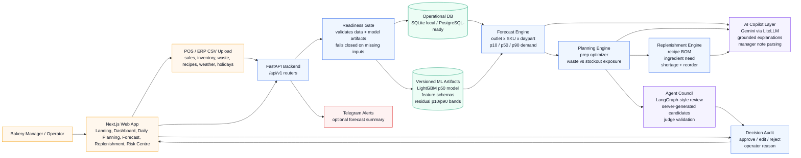

# Predictory - AI-Powered Bakery Intelligence Platform

Predictory is an AI-assisted prep and replenishment copilot for multi-outlet bakery-cafe chains. It converts imported operational data and trained LightGBM artifacts into next-day action plans by outlet, SKU, and daypart.

## Runtime Contract

Predictory does not synthesize production values when required data is missing. Forecast, planning, dashboard, replenishment, and Copilot pages may show loading, empty, or error states, but runtime paths must not invent forecast, prep, uncertainty, replenishment, financial exposure, or Copilot values.

API failures are explicit:

- `422` means required business data has not been imported or is invalid.
- `503` means the model bundle or a required external provider is unavailable.

## Core Features

| Feature | Description |
|---|---|
| Daily Planning | Forecast-backed prep recommendations, approval, edit, reject, and audit flow. |
| Demand Forecasting | LightGBM outlet x SKU x daypart forecasts with trained residual p10/p50/p90 bands. |
| Prep Planning | Optimizer-backed prep quantities with human-in-the-loop adjustments. |
| Replenishment | BOM-driven ingredient need, shortage, reorder quantity, urgency, and driving SKUs. |
| AI Copilot | Gemini-powered explanations, daily brief support, manager note parsing, and Agent Council review. |
| Multilingual | English, Bahasa Melayu, and Simplified Chinese response support. |
| Telegram Alerts | Optional forecast-summary notification through the Telegram Bot API. |

## Tech Stack

| Layer | Technologies |
|---|---|
| Frontend | Next.js 14, React 18, TypeScript, Tailwind CSS, TanStack Query, Recharts |
| Backend | FastAPI, SQLAlchemy 2.x, Alembic, Pydantic v2, Uvicorn |
| AI Layer | LiteLLM with Google Gemini API |
| Agent Layer | LangGraph-style daily action and Agent Council workflows |
| Notifications | Telegram Bot API via backend background task |
| Database | SQLite for local development; PostgreSQL for deployment |
| ML/Data | LightGBM, Pandas, NumPy, scikit-learn |

## Architecture Diagram



Design principle: **Forecast with ML. Optimize with rules. Explain with AI. Approve with humans.**

## Finals Repository Notes

This repository is the updated finals submission branch for Predictory. It includes:

- README and setup instructions for local backend, frontend, import, Copilot, and Telegram configuration.
- Architecture notes in [docs/architecture.md](./docs/architecture.md) and API contracts in [apps/api/CONTRACTS.md](./apps/api/CONTRACTS.md).
- Versioned ML artifacts in `backend/models/`.
- Tests, smoke-test entrypoints, and a documented fail-closed runtime contract.
- Finals-period improvements preserved in Git commit history instead of a one-shot code dump.

## What's New Since Preliminaries

Baseline used for comparison: commit `e6a633f` (`Improve UI`, 2026-03-12), the last commit strictly before 2026-03-13 in this repository history.

| Area | Before 2026-03-13 baseline | Finals improvement |
|---|---|---|
| Product identity | README and docs still used the earlier **BakeWise** framing. | Renamed and reframed as **Predictory**, a decision layer between yesterday's sales and tomorrow's bake plan. |
| Data setup | Local demo depended on `python -m db.seed` seeded runtime data. | Runtime seed dependency was removed. Clean databases are populated through import/readiness flows, and missing data blocks planning instead of creating fake numbers. |
| Forecasting | Forecasting was described as day-ahead planning, but runtime behavior still included prototype/demo paths. | Forecast generation now builds DB-backed feature rows and uses versioned LightGBM artifacts plus trained residual p10/p50/p90 bands. |
| Fail-closed contract | Missing data/model/provider behavior was not yet a central product contract. | Forecast, planning, dashboard, replenishment, and Copilot paths fail closed with explicit `422` or `503` errors instead of synthetic values. |
| Daily Planning | Prep planning existed, but the recommendation surface was less evidence-driven. | Added readiness blocking, backend summary fields, priority scoring, model evidence drawer, uncertainty range UI, approval drawer, audit preview, and manager note workflow. |
| Agentic decision support | Baseline had daily Copilot/daily-actions support, but no selected-recommendation council. | Added Agent Council review for one recommendation at a time, with deterministic candidate quantities, specialist arguments, judge validation, and human confirmation. |
| Manager notes | Notes were Copilot-oriented and less transparent about application mode. | Manager note parsing is Gemini-only, validated against forecast context, and applied only as explicit `prep_edit_only`; no forecast recompute is claimed. |
| AI explanations | Copilot explanations existed, but grounding and UI evidence handling were less strict. | Added grounded explanation endpoints and sheets. Gemini receives exact evidence JSON and must not invent or change operational numbers. |
| Replenishment/risk | Replenishment and alert pages existed as core surfaces. | Improved BOM-driven ingredient shortage/reorder logic, stock-vs-need visuals, top-action exposure labels, production constraints, and risk-center filtering. |
| Frontend navigation | Earlier UI used simpler navigation and route structure. | Added grouped sidebar, stock/catalog/admin tools, POS/ERP upload gate, product-led landing page, route prefetching, loading skeletons, and dashboard workflow polish. |
| Multilingual/ASEAN readiness | Baseline supported English, Bahasa Melayu, and Simplified Chinese in-app. | Added ASEAN currency detection from uploaded CSV context, Google Translate widget support, refreshed language configuration, and broader ASEAN-facing setup notes. |
| Integrations | Gemini/Copilot was present; notifications were not part of the baseline README. | Added optional Telegram forecast-summary integration, setup variables, and background notification task. |
| Documentation/testing | README had quick-start and route notes. | Added setup guide, API contracts, architecture notes, Agent Council docs, manager-note docs, live smoke test, test factories, and backend/frontend verification instructions. |

## APIs, Models, and Integrations Used

| Category | Used In Predictory |
|---|---|
| Forecast model | `lightgbm_p50_v1.pkl` predicts outlet x SKU x daypart p50 demand. |
| Uncertainty artifacts | `residual_bands_v1.json` provides trained p10/p50/p90 planning bands. |
| Feature schemas | `feature_schema_v1.json` and `encoded_feature_schema_step8.json` define model input shape. |
| Backend API | FastAPI REST API under `/api/v1`, documented in `/docs` and [CONTRACTS.md](./apps/api/CONTRACTS.md). |
| LLM API | Google Gemini through LiteLLM for grounded explanations, daily action phrasing, and manager note parsing. |
| Agent workflows | LangGraph dependency is used for graph-style daily action and Agent Council orchestration. |
| Notification API | Telegram Bot API sends optional forecast summaries when `TELEGRAM_BOT_TOKEN` and `TELEGRAM_CHAT_ID` are configured. |
| Weather/data | Weather rows can be imported; optional weather fetch settings are controlled through environment variables. |

Primary API groups:

| API Group | Purpose |
|---|---|
| `/api/v1/imports/upload` | Protected CSV ingestion for outlets, products, ingredients, recipes, sales, inventory, waste, weather, and holidays. |
| `/api/v1/forecast-readiness` | Checks whether a selected date has enough data and usable model artifacts before forecast/planning runs. |
| `/api/v1/forecasts/*` | Creates, reads, and regenerates LightGBM-backed forecast runs. |
| `/api/v1/daily-plan/*` and planning routes | Serves Daily Planning recommendations, summaries, approval/edit/reject flows, and replenishment refresh behavior. |
| `/api/v1/copilot/*` | Grounded Gemini explanations, manager-note parsing/apply flow, daily actions, and scenario support. |
| `/api/v1/copilot/council/*` | Selected-recommendation Agent Council review, review-with-note, and confirmed prep edit. |
| `/api/v1/alerts/*`, `/api/v1/catalog`, `/api/v1/outlets`, `/api/v1/skus` | Supporting risk, catalog, outlet, SKU, stock, and operational data surfaces. |

## AI Transparency Statement

Predictory separates numerical decision logic from generative AI:

- **ML calculates demand:** LightGBM predicts p50 demand; trained residual artifacts provide p10/p90 uncertainty bands.
- **Rules optimize operations:** deterministic planning and replenishment logic calculates prep quantities, exposure, ingredient need, reorder quantity, and urgency.
- **Gemini explains and parses:** Gemini is used for plain-language explanations, daily brief phrasing, and manager note parsing. It is not allowed to create operational numbers.
- **Humans approve:** operators review, edit, approve, or reject prep decisions before they are recorded.

AI tools/platforms disclosed:

| Tool / Platform | Purpose |
|---|---|
| Google Gemini API via LiteLLM | Runtime grounded explanations, manager note parsing, daily-action phrasing. |
| LightGBM | Trained demand forecasting model. |
| LangGraph | Agent-style orchestration for daily actions and selected-recommendation Agent Council review. |
| ChatGPT/Codex and Gemini/Antigravity-style development assistants | Development support for planning, refactoring, UI polishing, docs drafting, and code navigation. |
| AI image generation | Landing-page visual assets under `apps/web/public/landing/`. |

Custom engineering done by the team:

- Data import/readiness contracts, fail-closed API behavior, and protected ingestion routes.
- Feature-row construction from operational DB data into the trained LightGBM schema.
- Prep optimizer, waste-vs-stockout exposure logic, BOM replenishment, and risk alerts.
- Frontend Daily Planning, Dashboard, Replenishment, Risk Centre, Forecast Evidence, Agent Council, and upload-gate flows.
- Tests, smoke test, documentation, and Telegram integration.

## ASEAN Relevance, SDG Alignment, and Scalability

Predictory targets bakery and cafe MSMEs because they often make perishable production decisions with limited planning staff, spreadsheet-heavy workflows, and thin margins. ASEAN-facing relevance is built into the product through CSV-first onboarding, English/Bahasa Melayu/Simplified Chinese UI support, ASEAN currency detection, low-infrastructure local development, and a workflow designed for multi-outlet food operators.

External context: ASEAN publications describe MSMEs as a major regional economic base, with recent ASEAN business material citing MSMEs as up to 97% of establishments, 45% of regional GDP, and 85% of employment. UN SDG 12 Target 12.3 calls for halving per-capita food waste at retail and consumer levels and reducing food losses across production and supply chains.

SDG alignment:

| SDG | Predictory Alignment |
|---|---|
| SDG 12: Responsible Consumption and Production | Primary alignment. Forecast-backed prep and BOM replenishment help bakery operators reduce avoidable overproduction and ingredient waste. |
| SDG 13: Climate Action | Reducing avoidable food waste can lower the climate impact associated with wasted ingredients, production energy, and disposal. |
| SDG 12 Target 12.3: Food loss and waste reduction | Predictory directly supports the target of reducing food waste at retail and food-service levels through demand-aware production planning. |

Scalability / future roadmap:

| Horizon | Roadmap |
|---|---|
| Pilot | Run with 1-3 bakery/cafe operators using CSV exports from POS/ERP systems and country-specific currency/language defaults. |
| Productization | Add authentication, tenant isolation, managed PostgreSQL deployment, scheduled imports, and production monitoring. |
| Integrations | Connect to POS/ERP APIs, supplier ordering systems, Telegram/WhatsApp alerts, and weather/holiday data providers. |
| Model improvement | Retrain on real bakery data, add promotion/event features, improve stockout censoring, and compare model families beyond LightGBM. |
| Market reach | Start with Malaysia/Singapore bakery MSMEs, then expand to ASEAN food-service chains with similar perishable planning workflows. |

External references:

- ASEAN MSME context: https://asean.org/wp-content/uploads/2025/03/ASEAN-for-Business-Bulletin-January-2025.pdf
- UN SDG 12 Target 12.3: https://sdgs.un.org/goals/goal12

## Repo Structure

```text
apps/
  api/        FastAPI backend, migrations, forecasting, planning, copilot, tests
  web/        Next.js frontend

backend/models/              LightGBM model, feature schema, metrics, residual bands
scripts/ml_pipeline/         Reproducible ML training pipeline
scripts/smoke_test_live_flow.py
```

## Local Setup

### 1. Configure Environment

Create the root `.env` file from `.env.example`:

```powershell
Copy-Item .env.example .env -Force
```

Use local development values:

```env
DATABASE_URL=sqlite:///./predictory.db
GEMINI_API_KEY=your_google_ai_studio_key
GEMINI_MODEL=gemini/gemini-3-flash-preview
LLM_MAX_TOKENS=4096
DAILY_AGENT_MAX_TOP_ACTIONS=5
WEATHER_FETCH_ENABLED=true
WEATHER_TIMEOUT_SECONDS=2
SECRET_KEY=change-me-in-production-use-openssl-rand-hex-32
ENVIRONMENT=development
ADMIN_API_TOKEN=change-me-local-admin-token
ALLOWED_ORIGINS=http://localhost:3000,http://127.0.0.1:3000,http://localhost:5500,http://127.0.0.1:5500
NEXT_PUBLIC_API_URL=http://127.0.0.1:8000
API_BASE_URL=http://127.0.0.1:8000/api/v1
TELEGRAM_BOT_TOKEN=
TELEGRAM_CHAT_ID=
```

### 2. Run Backend

```powershell
cd apps/api
py -m venv .venv
.\.venv\Scripts\Activate.ps1
py -m pip install -r requirements.txt
alembic upgrade head
py -m uvicorn main:app --reload --host 127.0.0.1 --port 8000
```

Check:

```text
http://127.0.0.1:8000/health
http://127.0.0.1:8000/docs
```

### 3. Import Operational Data

Populate a clean database through `/api/v1/imports/upload` before running forecasts. Supported CSV types:

- `outlets`
- `products`
- `ingredients`
- `recipes`
- `sales`
- `inventory`
- `waste`
- `weather`
- `holidays`

Required references are strict: sales, inventory, waste, and recipe rows must reference outlets, SKUs, and ingredients that have already been imported.
CSV import requires `Authorization: Bearer <ADMIN_API_TOKEN>` unless local development explicitly sets `ALLOW_UNAUTHENTICATED_IMPORTS=true`.

Before generating a forecast, check:

```text
GET /api/v1/forecast-readiness?target_date=YYYY-MM-DD
```

### 4. Run Frontend

In another terminal:

```powershell
cd apps/web
Set-Content .env.local "NEXT_PUBLIC_API_URL=http://127.0.0.1:8000"
npm.cmd install
npm.cmd run dev -- --hostname 127.0.0.1 --port 3000
```

Open:

```text
http://127.0.0.1:3000
```

The root route opens the product landing page. The main demo CTA routes through `/data-upload`, then the operational workflow continues through Dashboard, Daily Planning, Replenishment, Risk Centre, and Copilot.

### 5. Optional Telegram Forecast Alerts

Telegram alerts are optional. If `TELEGRAM_BOT_TOKEN` and `TELEGRAM_CHAT_ID` are empty, the backend skips notification delivery and logs a warning.

To enable:

1. Create a Telegram bot through BotFather and set `TELEGRAM_BOT_TOKEN`.
2. Send a message to the bot from the target account or group.
3. Set `TELEGRAM_CHAT_ID`.
4. Restart the backend so the environment variables are loaded.

Forecast routes that create or regenerate a forecast run can enqueue the Telegram summary background task.

## Operator Flow

1. Import outlets, SKUs, ingredients, recipe BOM, sales history, inventory, waste, weather, and holidays.
2. Check forecast readiness for the planning date.
3. Generate a forecast run.
4. Review `/daily-planning` recommendations and model evidence.
5. Use manager notes only after confirming the parsed adjustment.
6. Approve or edit prep lines with an operator reason.
7. Review `/replenishment` for ingredient shortage and reorder actions.

## ML Runtime

The live backend uses the trained LightGBM bundle in `backend/models/`:

- `lightgbm_p50_v1.pkl`
- `feature_schema_v1.json`
- `encoded_feature_schema_step8.json`
- `residual_bands_v1.json`
- `model_metrics_v1.json`

Forecast generation builds encoded feature rows from database data for each outlet/SKU/daypart/date. The runtime engine is `lightgbm_mlops_prototype`, and forecast lines use method `lightgbm_p50_v1`. Residual artifacts provide p10/p50/p90 bands; missing artifacts fail closed.

## Testing

Backend:

```powershell
py -m compileall apps\api\admin apps\api\alerts apps\api\catalog apps\api\copilot apps\api\db apps\api\forecasting apps\api\ingestion apps\api\ops_data apps\api\planning apps\api\services
py -m pytest apps\api\tests -p no:cacheprovider
```

Frontend:

```powershell
cd apps/web
npm.cmd run typecheck
npm.cmd run build
```

Live smoke test, after data import:

```powershell
py scripts\smoke_test_live_flow.py
```

## Troubleshooting

### Readiness reports missing data

Import the blocker listed by `/api/v1/forecast-readiness`. Forecast and Daily Planning will not show numbers until readiness passes.

### Forecast endpoint returns `503`

Verify the files in `backend/models/` exist and are readable by the backend process.

### Copilot endpoint returns `503`

Verify the backend sees Gemini config:

```powershell
cd apps/api
.\.venv\Scripts\python.exe -c "from copilot.router import _resolve_litellm_config; print(_resolve_litellm_config()[0])"
```

Then restart `uvicorn`; environment changes are not picked up by an already-running server process.

### Frontend cannot connect to backend

Check `apps/web/.env.local`:

```env
NEXT_PUBLIC_API_URL=http://127.0.0.1:8000
```

## Reference Docs

- [Local Setup Guide](./setup_guide.md)
- [Product Requirements](./docs/prd.md)
- [Architecture Notes](./docs/architecture.md)
- [Documentation](./docs/documentation.md)
- [Project Report](./docs/Predictory_Report.md)
- [API Contracts](./apps/api/CONTRACTS.md)
- [Copilot Examples](./apps/api/copilot/EXAMPLES.md)
- [LangGraph Daily Agent](./docs/langgraph_daily_agent.md)
- [Manager Note Modes](./docs/manager_note_modes.md)
- [Agent Council v1](./docs/agentic_framework_rebuild.md)
