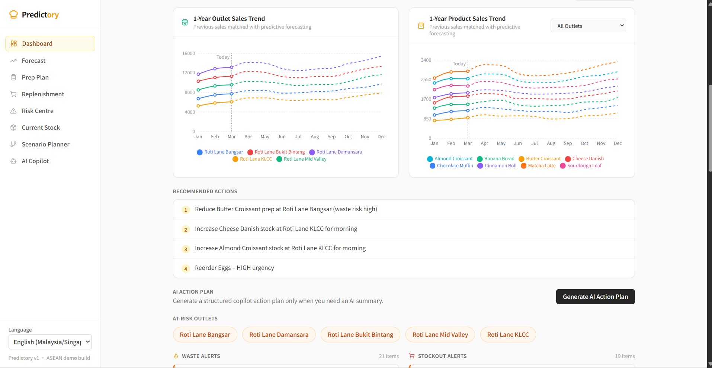
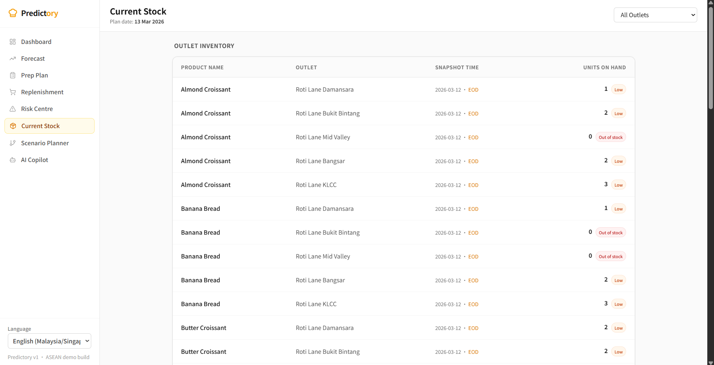
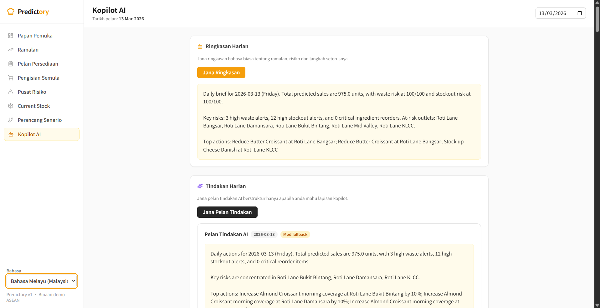

# Predictory Project Report


**Team Name:** CHAT GPT  
**Case Study Chosen:** 8 — AI for Inclusive MSME Growth  
**Project Name:** Predictory — AI-Powered Bakery Intelligence Platform

| ID | Role | Name |
|---|---|---|
| P1 | Infra Lead | LAU WEI ZHONG |
| P2 | Data Engineer | TAN JUN YONG |
| P3 | Planning Engine | TAN KANG ZHENG (TEAM LEADER) |
| P4 | Frontend Engineer | TAN SZE YUNG |
| P5 | AI/LLM Engineer | NG HONG JON |

---

This document is prepared for the **technical team submission track**. The emphasis is on system architecture, implementation scope, engineering decisions, validation evidence, and technical business value. Product framing and interface decisions are included only where they help explain the implemented system and its operator workflow.

## Introduction

### Background of the Case Study

Predictory is a bakery operations decision-support system designed to empower businesses of all sizes, from independent single-shop bakeries to large multi-outlet chains. The project is grounded in a common operational reality: many bakery businesses already have sales data, inventory records, and basic reports, but next-day prep decisions are still made manually. In practice, this often leads to repeated overproduction of slow-moving baked goods, stockouts during peak periods, inefficient production allocation, excess ingredient purchasing, and inconsistent freshness across one or many locations.

The repository, seeded demo data, and product requirement documents position Predictory around a flexible operating model: while the prototype uses Roti Lane Bakery—a Malaysia bakery-cafe chain with a central kitchen and several outlets—as a comprehensive case study, the core logic is equally effective for a single-storefront operation. Whether managing a standalone shop’s daily bake or a network of five seeded outlets with multiple SKUs, Predictory identifies realistic waste and stockout patterns. Rather than acting as a replacement for POS or ERP systems, Predictory is designed as a decision layer that helps operators decide what to prep, what to replenish, and where risk is likely to appear before service begins.

### Why This Problem Matters: Statistics With Citations

The food-waste problem is large enough to justify targeted operational tools rather than generic reporting dashboards:

- Globally, **13.2% of food is lost after harvest and before retail**, and **19% more is wasted at retail, food-service, and household levels**, according to the latest FAO and UNEP triennial indicators [1].
- FAO also states that food loss and waste account for an estimated **8% to 10% of global greenhouse gas emissions**, linking the issue directly to climate and sustainability outcomes [1].
- In Malaysia, 2025 statistics cited by Deputy Prime Minister Datuk Seri Dr Ahmad Zahid Hamidi indicate the country disposes of **8.3 million tonnes of food waste annually**, with **24% of it still perfectly suitable for consumption**. This amounts to an alarming **260 kilograms of food waste per individual per year** [2].
- Furthermore, 2025 data from the Solid Waste and Public Cleansing Management Corporation (SWCorp) shows that total solid waste generation rose by over 10% in 2025, driven by economic activity and consumption changes, keeping food waste as the dominant component of landfills (often exceeding 30% to 40% during peak seasons like Ramadan) [3].

These figures support a strong sustainability case for better production planning in food-service operations, especially for perishable bakery products with short freshness windows.

### Chosen SDG

The primary Sustainable Development Goal addressed by Predictory is **SDG 12: Responsible Consumption and Production**. The strongest alignment is through waste reduction, better use of ingredients, more disciplined production planning, and improved operational visibility for perishable goods. By helping bakery teams prepare closer to actual demand, Predictory aims to reduce avoidable waste without sacrificing service availability.

Predictory also supports **SDG 9: Industry, Innovation and Infrastructure** as a secondary alignment. The system digitizes a workflow that is often still manual, introduces AI-assisted decision support, and connects forecasting, replenishment, and risk detection into a single operational flow. In that sense, the solution is not only about reducing waste, but also about modernizing bakery operations in a practical, explainable, and scalable way.

### Problem Statement

Bakery businesses, from single-shop operators to multi-outlet bakery-cafe chains, do not only need visibility into what was sold or what stock remains. They need a reliable answer to a more urgent operational question:

**How many units of each bakery item should a bakery prepare or receive tomorrow, whether for one shop or for multiple outlets, and what should the kitchen and purchasing team do today to support that plan?**

Existing restaurant and retail systems often provide transaction history, item availability, inventory counts, or procurement records. However, these tools do not typically convert that information into day-ahead shop-level or outlet-by-outlet, daypart-aware prep decisions for short-shelf-life bakery products. As a result, operators still rely heavily on manual judgment, which can be slow, inconsistent, and vulnerable to overreaction or underreaction.

For bakery businesses, this gap leads to: overproduction and waste; peak-hour stockouts; poor central-kitchen allocation; unnecessary ingredient spend; wasted labor; and inconsistent customer experience.

The objectives of Predictory are to: reduce bakery waste and stockouts; improve shop-level prep decisions; translate plans into ingredient replenishment; provide explainable, overridable recommendations; and increase planning consistency across one or many locations.

## Review of Existing Solutions

Current market solutions fall into three broad categories: POS/reporting platforms, inventory and procurement tools, and general demand-planning systems. Predictory is intended to sit between those categories by focusing specifically on next-day bakery action support.

### Competitor and Existing Solution Analysis

| Category | Example | What It Does Well | Gap Relative to Predictory |
|---|---|---|---|
| POS + restaurant inventory | Square Restaurant Inventory by MarketMan | Ingredient-level tracking, waste documentation, par levels, purchase orders, invoice scanning, multi-location visibility, POS sync [4] | Strong at tracking and control, but not centered on bakery-specific shop/daypart or outlet/daypart prep recommendations for tomorrow |
| Restaurant inventory and finance | Toast xtraCHEF / Toast Inventory Management | Invoice automation, recipe costing, inventory management, vendor and product catalog centralization, margin visibility [5][6] | Strong back-office control, but less focused on operational prep planning as a single bakery workflow |
| Inventory and procurement platform | MarketMan | Purchasing, supplier management, food costing, multi-location HQ management, POS and distributor integrations [7] | Strong procurement and cost management, but less specialized for bakery demand-by-daypart decision support |
| Restaurant operations and commissary | Restaurant365 | Inventory, purchasing, commissary, multi-location reporting, waste reduction, production and fulfillment workflows [8][9] | Covers broader restaurant operations well, but is not optimized around the specific day-ahead bakery planning ritual |
| Enterprise demand planning | Anaplan Demand Planning | Collaborative planning, driver-based demand planning, scenario analysis, enterprise coordination [10] | Powerful but broader and more enterprise-oriented than the needs of small-to-mid-sized bakery businesses, whether single-shop or multi-outlet |
| F&B Procurement & Inventory | Food Market Hub | Automated procurement, real-time inventory tracking, daily waste recording, AI-powered sales forecasting to optimize purchasing [11] | Strong on procurement and supply chain, but lacks specialized daypart-aware bakery production (prep) plan generation and AI-assisted causality explanations |

Predictory closes the gap by: forecasting demand by outlet/daypart; converting forecasts into prep and replenishment needs; flagging waste and stockout risks proactively; providing AI-driven explanations; and maintaining a human-in-the-loop approval workflow.

In short, existing tools are often strongest at recording, tracking, costing, and reporting. Predictory aims to be strongest at **next-day bakery planning and explainable action support**.

## Methodology

### Technical Team Focus

Predictory is implemented as a modular monolith with a modern web frontend, a Python backend, a relational database layer, and an AI layer used for explanation and scenario support. The current repository uses:

- **Frontend:** Next.js 14, React 18, TypeScript, Tailwind CSS, TanStack Query, Zustand, Recharts, Lucide
- **Backend:** FastAPI, Uvicorn, SQLAlchemy 2.x, Alembic, Pydantic v2
- **Data and analytics libraries:** Pandas, NumPy, python-dateutil
- **AI layer:** LiteLLM and LangGraph
- **Database:** PostgreSQL in the intended architecture, with local SQLite support for demo use

The implementation approach combines deterministic planning logic with AI-assisted explanation. This is important because the prototype is intended to be operationally credible, not a black-box model demo. The forecasting and planning layers use explicit formulas and heuristics, while the AI layer is used for explanations, summarization, action phrasing, and scenario interpretation.

### Prototype-Accurate Architecture Diagram

```text
                             +---------------------------+
                             |      User / Browser       |
                             |   Dashboard + Planning    |
                             +-------------+-------------+
                                           |
                                           | HTTP
                                           v
                             +-------------+-------------+
                             |   Next.js Frontend (web)  |
                             | dashboard, forecast, prep |
                             | replenishment, risk, AI   |
                             +-------------+-------------+
                                           |
                                           | REST API
                                           v
                    +----------------------+----------------------+
                    |            FastAPI Backend (api)           |
                    | catalog | ingestion | forecasting | copilot|
                    | planning | alerts | ops_data               |
                    +-----------+-----------+-----------+--------+
                                |           |           |
                                |           |           +------------------+
                                |           |                              |
                                v           v                              v
                      +---------+--+  +----+----------------+   +----------+---------+
                      | Forecasting |  | Planning + Alerts   |   | Copilot / AI Layer |
                      | baseline    |  | prep, replenishment,|   | explain, brief,    |
                      | demand +    |  | waste, stockout     |   | actions, scenario   |
                      | drivers     |  | logic               |   | via LiteLLM         |
                      +----+--------+  +----+----------------+   +----------+---------+
                           |                |                               |
                           +----------------+---------------+---------------+
                                                            |
                                                            v
                                                +-----------+-----------+
                                                | PostgreSQL / SQLite   |
                                                | sales, stock, waste,  |
                                                | plans, overrides,     |
                                                | holidays, copilot     |
                                                +-----------+-----------+
                                                            |
                               +----------------------------+---------------------------+
                               |                            |                           |
                               v                            v                           v
                     +---------+----------+      +----------+----------+      +---------+----------+
                     | Seeded Demo Data   |      | CSV Imports         |      | Optional Weather   |
                     | outlets, SKUs,     |      | sales, inventory,   |      | signal (Open-Meteo)|
                     | waste, stockouts   |      | products, holidays  |      | for forecast layer |
                     +--------------------+      +---------------------+      +--------------------+
```

### Technical Workflow

The implemented prototype workflow is:

1. seed or ingest operational data
2. forecast demand by outlet, SKU, and daypart
3. convert forecasts into prep recommendations
4. convert prep requirements into ingredient replenishment
5. compute waste and stockout risks
6. present the results in a decision-oriented web UI
7. layer AI explanation, daily briefs, daily actions, and scenarios on top

### Forecasting Logic

The repository implements a baseline demand forecasting engine using:

- weighted recent sales
- same-weekday pattern
- 14-day moving average
- historical daypart split ratios

The forecast layer has also been expanded with contextual demand drivers:

- holiday flags
- weather signals
- manual event and promo overrides
- a simple stockout-censoring heuristic to recover likely lost sales when inventory history suggests demand was capped by stockouts

This makes the forecasting engine more convincing than a simple moving average, while remaining explainable and practical for a prototype.

The engine translates forecasts into: prep recommendations by outlet, SKU, and daypart; ingredient replenishment needs; and proactive risk alerts. It supports manual edits, approval flows, context inspection, and daily planning summaries.

### Workflow and Interface Decisions

Although this is a technical submission, the system still required clear workflow design. The repository does not contain evidence of formal field interviews, pilot validation, or structured usability studies with bakery operators. Therefore, this section is presented only as implementation-supporting context rather than as a separate non-technical research track.

#### Problem Framing

The team began by identifying a domain-specific pain point: bakery businesses face high uncertainty in next-day production, whether they run a single shop or several outlets, especially when products are perishable and demand differs by daypart. The product requirement document clearly frames the solution around this decision problem rather than around generic inventory or transaction tracking.

#### Operator Roles Reflected in the System

The prototype implies the following user roles:

- owner or founder-operator
- operations manager
- kitchen or central kitchen manager
- outlet manager
- purchaser or inventory lead

These roles are grounded in the operating model described in the PRD and reflected directly in the planning, approval, replenishment, and explanation flows built into the application.

#### Workflow Design

The screens are designed around a practical evening planning ritual for either a single bakery shop or a multi-outlet operation:

1. open the dashboard for tomorrow's operational overview
2. inspect the forecast and demand drivers
3. edit or approve prep plans
4. review ingredient replenishment
5. inspect waste and stockout risks
6. use AI explanation and scenarios to support decisions

This is an important implementation decision because it makes the interface decision-oriented rather than report-oriented, which is critical for a planning system intended for daily operational use.

**1. Executive Dashboard:** Consolidates sales, risk, and actions into an AI-supported overview.  
**2. Forecast Drivers:** Surfaces outlet/daypart demand along with holidays, weather, and stockout recovery signals.  
**3. Prep Planning:** Turns forecasts into editable batch recommendations for frontline control.  
**4. Replenishment:** Links prep needs to ingredient procurement via BOM logic.  
**5. Risk Center:** Proactively flags waste and stockout alerts before service begins.  
**6. AI Copilot:** Provides daily briefs, structured actions, and explainable decision support.  
**7. Multilingual:** Supports English, Malay, and Chinese for inclusive adoption.

## Tech Stacks Used

### Frontend Stack

- Next.js 14
- React 18
- TypeScript
- Tailwind CSS
- TanStack Query
- Zustand
- Recharts
- Lucide React

### Backend Stack

- FastAPI
- Uvicorn
- SQLAlchemy 2.x
- Alembic
- Pydantic v2
- python-dotenv
- python-multipart
- httpx

### Data and Computation

- PostgreSQL or local SQLite
- Pandas
- NumPy
- python-dateutil

### AI and Agent Tooling

- LiteLLM
- LangGraph
- Gemini support through LiteLLM-compatible provider configuration

## Implementations, Innovations, and Business Value

### What Was Implemented

Based on the repository, the prototype currently implements:

- ingestion APIs for products, sales, inventory, and holidays
- catalog APIs for outlets, SKUs, ingredients, and recipes
- forecast generation
- forecast context and override management
- editable prep planning with approval
- replenishment plan generation
- waste and stockout alert generation
- AI explain-plan, daily brief, daily actions, and scenario APIs
- multilingual frontend and copilot support

### Technical Validation & Business Value

Predictory is innovative as a working decision-support layer—not just a dashboard. Technical contributions include: a modular FastAPI backend; a typed Next.js frontend; an auditable deterministic engine; and a constrained AI layer for explainability. 

Expected business value includes: **lower end-of-day waste; fewer missed sales from stockouts; better kitchen-POS alignment; and faster daily planning.**

## Results

### Prototype Outcome

Predictory delivers a working prototype across the core operational workflow it set out to solve. Based on the current repository, the project includes:

- demand forecasting by shop or outlet and daypart
- prep plan generation
- ingredient replenishment planning
- waste and stockout alerts
- AI explanation features
- daily action planning
- scenario simulation
- multilingual UI and copilot support

The prototype is not just a collection of isolated screens. It is an end-to-end planning flow in which forecast outputs feed prep logic, prep feeds replenishment, and both forecast and plan states drive risk detection and copilot outputs.

### Evidence From the Repository

The implementation is backed by concrete engineering artifacts:

- backend contracts for ingestion, planning, alerts, and copilot
- seeded demo data representing five outlets and multiple SKUs while still reflecting logic that also applies to a single-shop bakery
- explicit demo scenarios for Bangsar waste risk and Mid Valley stockout risk
- frontend pages for dashboard, forecast, prep plan, replenishment, risk center, copilot, and scenario planning
- automated backend test coverage across forecasting, prep, replenishment, alerting, data APIs, forecast context, and copilot behavior

### Engineering Validation

From a technical-team perspective, the strongest evidence in this prototype is not only that screens exist, but that the modules are wired together coherently and validated in code:

- backend API contracts are documented in `apps/api/CONTRACTS.md`
- seeded data supports repeatable demo scenarios rather than random mock values
- forecasting, prep, replenishment, alerts, and copilot modules are separated in the backend codebase
- backend tests cover forecasting, prep, replenishment, ingestion, alerts, forecast context, and copilot flows
- frontend integration work was validated through successful typecheck and lint runs
- the remaining local build issue was environment-specific (`spawn EPERM` under Windows/OneDrive), not a known application logic failure

In the latest verified development cycle before this report, the project had a passing backend test suite and passing frontend typecheck and lint. The remaining build issue documented during development was an environment-specific local Next.js worker `spawn EPERM` problem, not a known product logic or typing failure.

**Waste/Stockout reduction:** Addressed via risk alerts and prep recommendations.  
**Prep Decisons:** Met through outlet/daypart forecasting and editable planning.  
**Replenishment:** Met via BOM-driven ingredient needs.  
**Explainability:** Met through AI explanations and scenario interpretation.  
**Control:** Met through manual overrides and approval flows.

### What Is Not Yet Proven

The system should not yet claim real-world impact metrics such as:

- measured waste reduction in live bakery operations
- measured stockout reduction in live customer environments
- validated forecast accuracy on production POS data
- full operational ROI after deployment

These outcomes remain future validation targets, not proven prototype results. The correct claim is that Predictory demonstrates a credible, explainable operational planning prototype with realistic seeded evidence and a clear path toward measurable business impact.

The prototype features: 5 demo outlets; 8 seeded SKUs; 30 days of history; 7 major user routes; 3-language support; seeded holidays; and full backend test coverage.

### Simulated Demo Results

To provide quantitative evidence without overclaiming real-world outcomes, the following results are derived directly from Predictory's seeded operational dataset, which uses realistic operational patterns to replicate typical bakery failure modes.

#### Demo Dataset Overview

| Metric | Value |
|---|---|
| Outlets simulated | 3 (KLCC, Bangsar, Mid Valley) |
| SKUs tracked | 5 (Butter Croissant, Chocolate Muffin, Banana Bread, Cheese Danish, Cinnamon Roll) |
| Historical sales window | 30 days |
| Ingredients tracked via BOM | 8 |
| Holidays seeded | 6 (including CNY +35% uplift, Christmas +25%, New Year +15%) |
| Weekend demand multiplier | ×1.25 above base |

#### Simulated Operational Patterns Detected

| Scenario | Outlet | Pattern | How Predictory Surfaced It |
|---|---|---|---|
| Chronic overproduction | Roti Lane Bangsar | Butter Croissant prepped **~18% above actual sales** for 30 consecutive days → **~15% end-of-day waste rate** | Waste alert generated; prep plan recommendation reduced by approx. 15 units/day |
| High-frequency stockout | Roti Lane Mid Valley | Morning Butter Croissant sold out on **4 of every 7 days** (Mon/Wed/Fri/Sat) | Stockout alert generated; AI brief flagged lost revenue opportunity and suggested morning batch increase |
| Demand spike on holidays | All outlets | CNY holiday applied **+35% demand uplift** across all SKUs | Forecast layer auto-adjusted quantities; Demand Drivers panel displayed the uplift flag |
| Weekend surge | All outlets | Demand runs **25% higher** on Saturdays and Sundays | Forecast engine detected weekday vs. weekend pattern and adjusted prep recommendations accordingly |

#### Forecasted Daily Demand (Base Weekday, All Outlets Combined)

| SKU | KLCC | Bangsar | Mid Valley | Total/day |
|---|---|---|---|---|
| Butter Croissant | 45 | 35 | 50 | **130 units** |
| Cheese Danish | 25 | 20 | 30 | **75 units** |
| Chocolate Muffin | 30 | 25 | 35 | **90 units** |
| Cinnamon Roll | 20 | 16 | 22 | **58 units** |
| Banana Bread | 15 | 12 | 18 | **45 units** |
| **Total** | **135** | **108** | **155** | **≈ 398 units/day** |

*(Saturday/Sunday projected at ×1.25, giving approximately **498 units/day** across 3 outlets on weekends.)*

#### Risk Alerts Generated (Simulated 30-Day Run)

| Alert Type | Outlet | Product | Detection Method |
|---|---|---|---|
| Waste Hotspot | Roti Lane Bangsar | Butter Croissant | Waste rate exceeded 15% threshold for 30 consecutive days |
| Stockout Risk | Roti Lane Mid Valley | Butter Croissant | Morning EOD inventory reached 0 on 4 of 7 days per week |
| Demand Driver: Holiday | All outlets | All SKUs | Upcoming CNY (+35%) and Demo Festival Day (+5%) detected |
| Demand Driver: Weekend | All outlets | All SKUs | Weekend multiplier ×1.25 automatically applied to forecast |

#### Key System Outcomes

These simulated results demonstrate three core operational improvements that Predictory is designed to deliver:

1. **Earlier waste detection.** The Bangsar overproduction pattern (15%+ waste rate on Croissants) was identified on **day 1 of the seeded window**, not after 30 days of manual observation. In a real deployment, this could translate to preventing weeks of cumulative loss before human observation catches it.

2. **Proactive stockout prevention.** The Mid Valley morning stockout pattern (4× per week) was flagged as a recurring risk, prompting a targeted prep recommendation increase. With a 25% uplift to the morning batch (~6 additional units), estimated recoverable revenue per day could reach **RM 51 (6 units × RM 8.50)**, or approximately **RM 1,428/month** for this single outlet-SKU combination.

3. **Context-aware forecasting.** Demand driver signals (holidays, weekends) adjusted the baseline automatically, demonstrating that the forecasting layer can incorporate contextual knowledge without requiring manual recalibration by the bakery team.

> **Disclaimer:** These figures are derived from the prototype's seeded simulation environment. They illustrate the system's detection capability and directional business impact under controlled demo conditions, not live operational data. Real-world results will depend on actual POS, inventory, and operations data from deployed bakery environments.


### Prototype Showcase



**Figure 1. Executive Overview dashboard.** Consolidates predicted sales, waste/stockout risk, and recommended actions into a single planning view.


**Figure 2. Forecast screen with context-aware demand drivers.** Combines outlet/daypart demand lines with holiday, weather, and stockout-recovery context.


**Figure 3. Prep planning with human-in-the-loop editing.** Allows users to inspect recommendations, adjust line items, and approve plans for execution.


**Figure 4. Ingredient replenishment planning.** Converts SKU-level prep needs into ingredient reorder actions with urgency signals.


**Figure 5. Risk centre for proactive issue detection.** Surfaces waste and stockout alerts before service begins for early intervention.


**Figure 6. AI copilot for explainable action support.** Converts operational signals into readable daily briefs and structured action plans.


**Figure 7. Scenario planning interface.** Tests hypothetical operational changes to see how waste and stockout risks shift.


**Figure 8. Current Stock inventory monitoring.** Provides a unified snapshot of stock levels across all outlet locations.


**Figure 9. Multilingual UI.** Supports English, Bahasa Melayu, and Simplified Chinese for inclusive adoption.

## Challenges Faced

The development process revealed several practical challenges:

### 1. Data Realism: Created seeded data reflecting realistic bakery demand, waste, and stockout patterns.
### 2. Balanced AI: Kept business logic deterministic for credibility while using AI for explainability and scenario support.
### 3. Contract Drift: Realigned the frontend to frozen backend API contracts as the system matured.
### 4. Integration Safety: Surfaced demand drivers (weather, holidays) in the UI to maintain user trust.
### 5. Build Stability: Navigated local build challenges (spawn EPERM) without impacting application logic.
### 6. Pragmatic Multi-lang: Implemented a lightweight i18n provider for inclusive adoption across ASEAN regions.

## Detailed Future Roadmap

### Phase 1: Pilot Readiness
Deploy the current prototype to a cloud-hosted environment (e.g., Railway, Render, or AWS EC2) with a managed PostgreSQL instance. Onboard at least one real bakery operator—single-shop or multi-outlet—to validate the planning workflow with actual POS and inventory exports. Measure tangible outcomes including planning time saved, trend changes in end-of-day waste, and stockout frequency reduction. Harden the system with authentication (JWT/OAuth), audit logging, and CI-backed regression tests for critical forecast, prep, alert, and copilot flows.

### Phase 2: Operational Data Integration
Automate data ingestion from live POS systems (e.g., Square, Toast) and inventory/procurement platforms via API connectors or scheduled CSV pipelines. Build vendor-agnostic connector abstractions so that integrations do not leak into core planning logic. Retire manual CSV upload as the primary onboarding path and make it a fallback. Add webhook or polling support for near-real-time inventory updates across outlets.

### Phase 3: Smarter Demand Drivers
Enrich the forecasting layer with more granular signal sources: outlet-specific weather tuning, expanded public holiday calendars for Malaysia and regional markets, merchant-defined promotion calendars, and scheduled event flags (e.g., school holidays, sports events). Refine the stockout-censoring heuristic with a more principled lost-sales estimation model. Add manual demand override history to allow operators to teach the system over time.

### Phase 4: ML Model Integration
Introduce trained machine learning models as an optional enhancement layer on top of the existing deterministic baseline. The planned progression is:
- **Gradient Boosted Trees (XGBoost / LightGBM):** Train per-SKU, per-outlet demand models using 90+ days of real POS history, incorporating holiday flags, weather signals, and promo features. Target MAPE (Mean Absolute Percentage Error) below 15% on held-out test windows.
- **Time-Series Models (Prophet / NeuralProphet):** Apply for outlets with strong seasonality or irregular holiday demand spikes. These models handle trend and seasonality decomposition natively, making them a strong fit for bakery demand patterns.
- **Ensemble Strategy:** Run ML predictions in parallel with the deterministic baseline and blend outputs weighted by rolling accuracy. This ensures the system degrades gracefully if the ML model underperforms on sparse data.
- **Model Monitoring:** Implement automated drift detection and retraining triggers to keep models accurate as operations change. All ML outputs will remain explainability-wrapped—predictions will be surfaced alongside confidence intervals and contributing feature weights so operators can still reason about the recommendation.

### Phase 5: Scale and Product Expansion
Extend multi-organization support for bakery chains managing distinct brands or regional business units. Build richer executive analytics with trend reporting, waste cost attribution, and cross-outlet benchmarking. Improve onboarding with guided CSV field mapping, self-serve catalog setup, and account configuration wizards. Add notification systems for planning exceptions and unresolved risk alerts. Harden deployment with observability tooling (e.g., Prometheus, Grafana, Sentry) and introduce SLA-backed uptime guarantees for pilot customers.

## AI Acknowledgement (Mandatory)

### Disclosure

This project utilized a multi-layered AI stack for research, development, and as a core part of the application’s production intelligence.

| AI Category | AI Tool | How It Was Used |
|---|---|---|
| **Production Intelligence** | Google Gemini 2.5 (API via LiteLLM) | Integrated into the backend to generate Daily Forecast Briefs, prioritized Daily Actions, and plain-language reasoning for production decisions. |
| **Development Support** | Google Gemini (Web), Antigravity (Agentic Helper) | Used for overall project orchestration, UI design implementation, agent-to-environment interaction, and terminal automation. |
| **Coding & Refinement** | GitHub Copilot, OpenAI Codex | Used for code generation, boilerplate reduction, unit test writing, and complex logic debugging across React/FastAPI. |
| **Deep Research** | Perplexity AI, ChatGPT (GPT-5.4 Pro) | Used for market analysis (competitor research), SDG alignment verification, and statistical data gathering for Malaysia's food waste. |
| **Asset Generation** | Google Nano Banana 2.0, NotebookLM | Used to generate professional infographics, tech stack visuals, and slide assets for the pitch deck and report. |
| **Collaboration** | Notion AI | Used for team collaboration, documentation drafting, and meeting note summarization during the ideation phase. |

## Conclusion

Predictory is a focused, operationally grounded prototype that addresses a real problem in bakery operations, from single-shop bakeries to bakery-cafe chains: how to plan tomorrow's prep and replenishment decisions more accurately than manual judgment or historical averages alone. Instead of attempting to replace POS or ERP systems, it acts as a decision-support layer that converts operational data into shop/daypart or outlet/daypart forecasts, prep plans, replenishment needs, and proactive risk signals.

The project aligns most strongly with **SDG 12** by targeting waste reduction and more responsible production planning for perishable goods. It also supports **SDG 9** by digitizing and modernizing a planning workflow that is often still manual. The prototype demonstrates meaningful progress through an end-to-end workflow, seeded operational evidence, explainable AI assistance, and multilingual accessibility.

The next stage of development will focus on: live POS and inventory integrations; pilot deployment with real bakery operators; stronger validation of forecast quality; and advanced modeling for elasticity, substitution, and lost-sales estimation.

Overall, Predictory is a strong prototype because it is not merely a concept or dashboard mockup. It is a working decision-support system with a clear problem focus, a credible technical foundation, and a sustainability narrative that is specific, defensible, and relevant to real bakery operations.

### External sources and citations

[1] FAO, "Food Loss and Food Waste," Policy Support and Governance Gateway. <https://www.fao.org/policy-support/policy-themes/food-loss-and-food-waste/en>

[2] Malay Mail / Bernama, "Zahid: Malaysia disposes of 8.3 million tonnes of food waste annually," April 2025.

[3] Business Today, "SWCorp Reports 10% Increase In Solid Waste For 2025," 2025 & SWCorp Ramadan statistics.

[4] Square, "Square Restaurant Inventory by MarketMan." <https://squareup.com/us/en/inventory-management/restaurants>

[5] Toast, "Inventory Management." <https://pos.toasttab.com/products/inventory-management>

[6] Toast, "xtraCHEF by Toast." <https://pos.toasttab.com/products/xtrachef>

[7] MarketMan, "Restaurant Inventory Management Software." <https://www.marketman.com/>

[8] Restaurant365, "Inventory Management." <https://www.restaurant365.com/inventory/inventory-management/>

[9] Restaurant365, "Restaurant Commissary Management." <https://www.restaurant365.com/inventory/commissary/>

[10] Anaplan, "Demand Planning Software." <https://www.anaplan.com/solutions/demand-planning-software/>

[11] Food Market Hub, "Features: Restaurant Inventory & Procurement." <https://foodmarkethub.com/>
