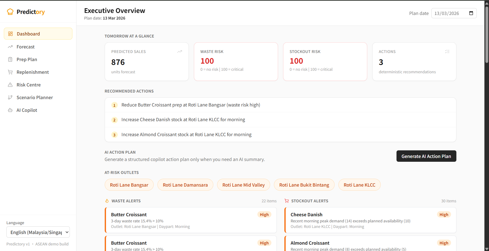
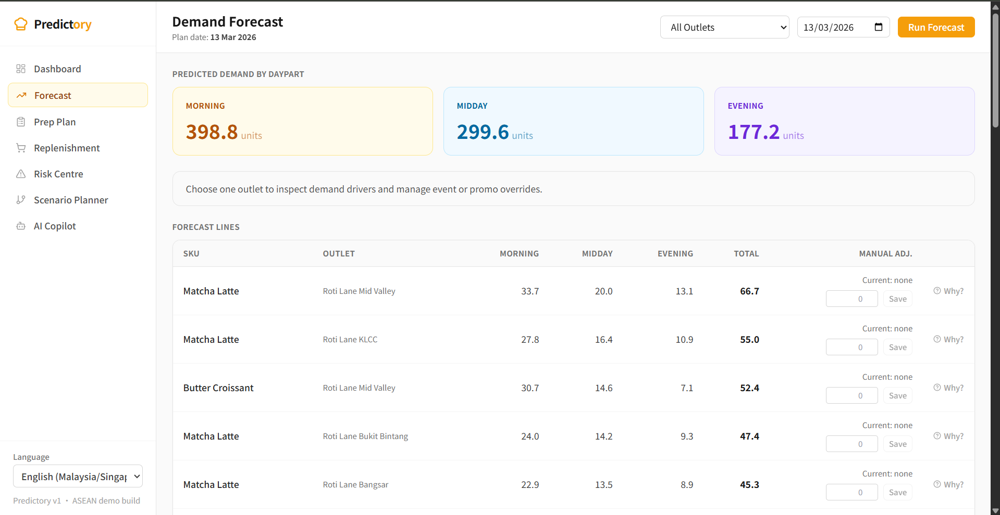
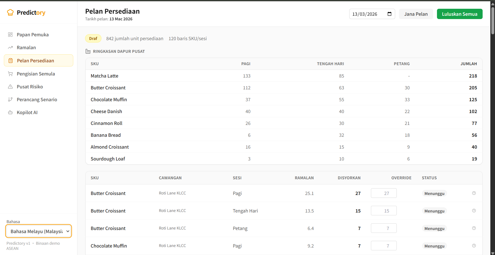
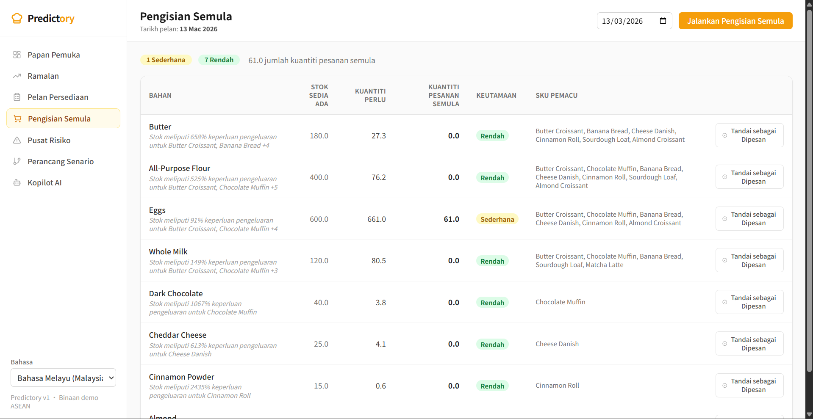
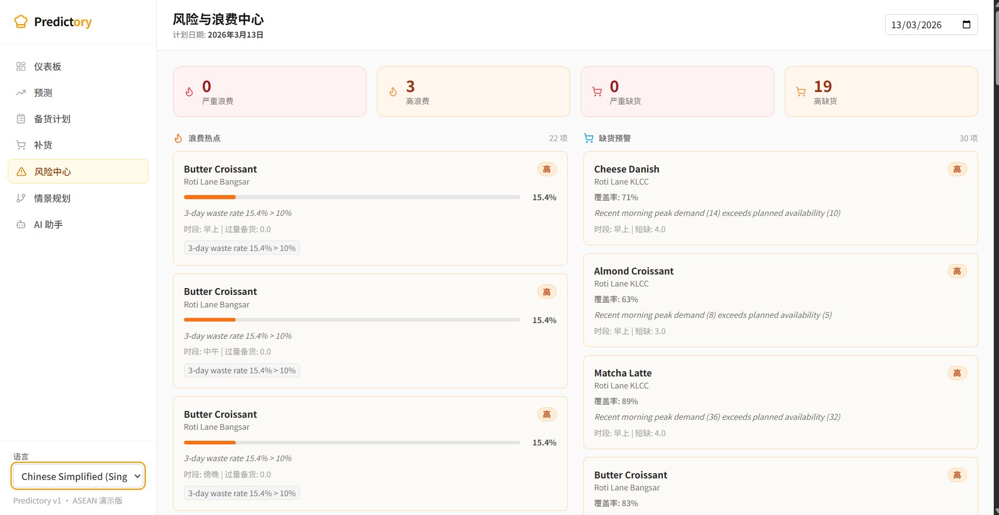
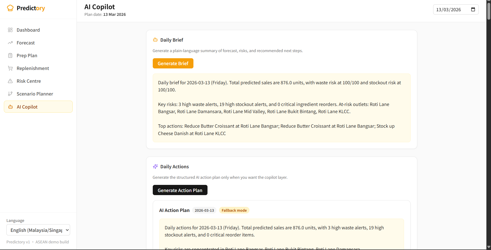
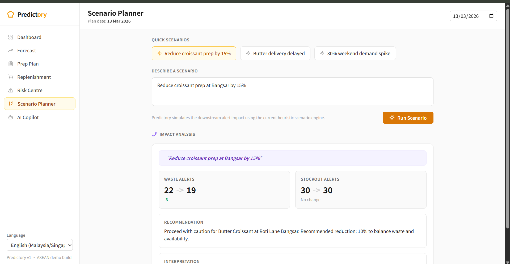

# Predictory Project Report

## Introduction

### Background of the Case Study

Predictory is a bakery operations decision-support system built for multi-outlet bakery-cafe chains. The project is grounded in a common operational reality: many bakery businesses already have sales data, inventory records, and basic reports, but next-day prep decisions are still made manually. In practice, this often leads to repeated overproduction of slow-moving baked goods, stockouts during peak periods, inefficient central-kitchen allocation, excess ingredient purchasing, and inconsistent freshness across outlets.

The repository, seeded demo data, and product requirement documents position Predictory around a very specific operating model: a Malaysia bakery-cafe chain with a central kitchen and several outlets. The prototype uses Roti Lane Bakery as the case study, with five seeded outlets, multiple SKUs, and realistic waste and stockout patterns. Rather than acting as a replacement for POS or ERP systems, Predictory is designed as a decision layer that helps operators decide what to prep, what to replenish, and where risk is likely to appear before service begins.

### Why This Problem Matters: Statistics With Citations

The food-waste problem is large enough to justify targeted operational tools rather than generic reporting dashboards:

- Globally, **13.2% of food is lost after harvest and before retail**, and **19% more is wasted at retail, food-service, and household levels**, according to the latest FAO and UNEP triennial indicators [1].
- FAO also states that food loss and waste account for an estimated **8% to 10% of global greenhouse gas emissions**, linking the issue directly to climate and sustainability outcomes [1].
- In Malaysia, 2025 statistics cited by Deputy Prime Minister Datuk Seri Dr Ahmad Zahid Hamidi indicate the country disposes of **8.3 million tonnes of food waste annually**, with **24% of it still perfectly suitable for consumption**. This amounts to an alarming **260 kilograms of food waste per individual per year** [2].
- Furthermore, 2025 data from the Solid Waste and Public Cleansing Management Corporation (SWCorp) shows that total solid waste generation rose by over 10% in 2025, driven by economic activity and consumption changes, keeping food waste as the dominant component of landfills (often exceeding 30% to 40% during peak seasons like Ramadan) [3].

These figures support a strong sustainability case for better production planning in food-service operations, especially for perishable bakery products with short freshness windows.

### Chosen SDG

The primary Sustainable Development Goal addressed by Predictory is **SDG 12: Responsible Consumption and Production**. The strongest alignment is through waste reduction, better use of ingredients, more disciplined production planning, and improved operational visibility for perishable goods. By helping bakery teams prepare closer to actual demand, Predictory aims to reduce avoidable waste without sacrificing service availability.

Predictory also supports **SDG 9: Industry, Innovation and Infrastructure** as a secondary alignment. The system digitizes a workflow that is often still manual, introduces AI-assisted decision support, and connects forecasting, replenishment, and risk detection into a single operational flow. In that sense, the solution is not only about reducing waste, but also about modernizing bakery operations in a practical, explainable, and scalable way.

### Problem Statement

Multi-outlet bakery-cafe chains do not only need visibility into what was sold or what stock remains. They need a reliable answer to a more urgent operational question:

**How many units of each bakery item should each outlet prepare or receive tomorrow, and what should the central kitchen and purchasing team do today to support that plan?**

Existing restaurant and retail systems often provide transaction history, item availability, inventory counts, or procurement records. However, these tools do not typically convert that information into day-ahead outlet-by-outlet, daypart-aware prep decisions for short-shelf-life bakery products. As a result, operators still rely heavily on manual judgment, which can be slow, inconsistent, and vulnerable to overreaction or underreaction.

For bakery-cafe chains, this gap has direct consequences:

- overproduction and end-of-day waste
- stockouts during morning and lunch peaks
- poor central-kitchen allocation across outlets
- unnecessary ingredient spend
- wasted labor and production capacity
- weaker consistency in freshness and customer experience

### Objectives

The objectives of Predictory are:

- reduce overproduction and end-of-day bakery waste
- reduce stockouts during peak selling windows
- improve outlet-level prep decisions by date and daypart
- translate prep plans into ingredient replenishment actions
- provide explainable recommendations that users can review and override
- reduce planning time and increase planning consistency across outlets
- give central-kitchen and operations teams a clearer, action-oriented view of tomorrow's plan

## Review of Existing Solutions

Current market solutions fall into three broad categories: POS/reporting platforms, inventory and procurement tools, and general demand-planning systems. Predictory is intended to sit between those categories by focusing specifically on next-day bakery action support.

### Competitor and Existing Solution Analysis

| Category | Example | What It Does Well | Gap Relative to Predictory |
|---|---|---|---|
| POS + restaurant inventory | Square Restaurant Inventory by MarketMan | Ingredient-level tracking, waste documentation, par levels, purchase orders, invoice scanning, multi-location visibility, POS sync [4] | Strong at tracking and control, but not centered on bakery-specific outlet/daypart prep recommendations for tomorrow |
| Restaurant inventory and finance | Toast xtraCHEF / Toast Inventory Management | Invoice automation, recipe costing, inventory management, vendor and product catalog centralization, margin visibility [5][6] | Strong back-office control, but less focused on operational prep planning as a single bakery workflow |
| Inventory and procurement platform | MarketMan | Purchasing, supplier management, food costing, multi-location HQ management, POS and distributor integrations [7] | Strong procurement and cost management, but less specialized for bakery demand-by-daypart decision support |
| Restaurant operations and commissary | Restaurant365 | Inventory, purchasing, commissary, multi-location reporting, waste reduction, production and fulfillment workflows [8][9] | Covers broader restaurant operations well, but is not optimized around the specific day-ahead bakery planning ritual |
| Enterprise demand planning | Anaplan Demand Planning | Collaborative planning, driver-based demand planning, scenario analysis, enterprise coordination [10] | Powerful but broader and more enterprise-oriented than the needs of small-to-mid-sized bakery-cafe chains |

### Gaps Predictory Intends to Fix

Predictory is designed to close a specific gap between reporting tools and action tools. It does this by:

- forecasting demand by outlet and daypart
- converting forecast into prep recommendations
- converting prep into ingredient replenishment needs
- flagging likely waste and stockout risks before production
- providing plain-language explanations and scenario simulation
- keeping a human-in-the-loop edit and approval workflow

In short, existing tools are often strongest at recording, tracking, costing, and reporting. Predictory aims to be strongest at **next-day bakery planning and explainable action support**.

## Methodology

### Technical Track

Predictory is implemented as a modular monolith with a modern web frontend, a Python backend, a relational database layer, and an AI layer used for explanation and scenario support. The current repository uses:

- **Frontend:** Next.js 14, React 18, TypeScript, Tailwind CSS, TanStack Query, Zustand, Recharts, Lucide
- **Backend:** FastAPI, Uvicorn, SQLAlchemy 2.x, Alembic, Pydantic v2
- **Data and analytics libraries:** Pandas, NumPy, python-dateutil
- **AI layer:** LiteLLM and LangGraph
- **Database:** PostgreSQL in the intended architecture, with local SQLite support for demo use

The implementation approach combines deterministic planning logic with AI-assisted explanation. This is important because the prototype is intended to be operationally credible, not a black-box model demo. The forecasting and planning layers use explicit formulas and heuristics, while the AI layer is used for explanations, summarization, action phrasing, and scenario interpretation.

### Prototype-Accurate Architecture Diagram

```text
                             +---------------------------+
                             |      User / Browser       |
                             |   Dashboard + Planning    |
                             +-------------+-------------+
                                           |
                                           | HTTP
                                           v
                             +-------------+-------------+
                             |   Next.js Frontend (web)  |
                             | dashboard, forecast, prep |
                             | replenishment, risk, AI   |
                             +-------------+-------------+
                                           |
                                           | REST API
                                           v
                    +----------------------+----------------------+
                    |            FastAPI Backend (api)           |
                    | catalog | ingestion | forecasting | copilot|
                    | planning | alerts | ops_data               |
                    +-----------+-----------+-----------+--------+
                                |           |           |
                                |           |           +------------------+
                                |           |                              |
                                v           v                              v
                      +---------+--+  +----+----------------+   +----------+---------+
                      | Forecasting |  | Planning + Alerts   |   | Copilot / AI Layer |
                      | baseline    |  | prep, replenishment,|   | explain, brief,    |
                      | demand +    |  | waste, stockout     |   | actions, scenario   |
                      | drivers     |  | logic               |   | via LiteLLM         |
                      +----+--------+  +----+----------------+   +----------+---------+
                           |                |                               |
                           +----------------+---------------+---------------+
                                                            |
                                                            v
                                                +-----------+-----------+
                                                | PostgreSQL / SQLite   |
                                                | sales, stock, waste,  |
                                                | plans, overrides,     |
                                                | holidays, copilot     |
                                                +-----------+-----------+
                                                            |
                               +----------------------------+---------------------------+
                               |                            |                           |
                               v                            v                           v
                     +---------+----------+      +----------+----------+      +---------+----------+
                     | Seeded Demo Data   |      | CSV Imports         |      | Optional Weather   |
                     | outlets, SKUs,     |      | sales, inventory,   |      | signal (Open-Meteo)|
                     | waste, stockouts   |      | products, holidays  |      | for forecast layer |
                     +--------------------+      +---------------------+      +--------------------+
```

### Technical Workflow

The implemented prototype workflow is:

1. seed or ingest operational data
2. forecast demand by outlet, SKU, and daypart
3. convert forecasts into prep recommendations
4. convert prep requirements into ingredient replenishment
5. compute waste and stockout risks
6. present the results in a decision-oriented web UI
7. layer AI explanation, daily briefs, daily actions, and scenarios on top

### Forecasting Logic

The repository implements a baseline demand forecasting engine using:

- weighted recent sales
- same-weekday pattern
- 14-day moving average
- historical daypart split ratios

The forecast layer has also been expanded with contextual demand drivers:

- holiday flags
- weather signals
- manual event and promo overrides
- a simple stockout-censoring heuristic to recover likely lost sales when inventory history suggests demand was capped by stockouts

This makes the forecasting engine more convincing than a simple moving average, while remaining explainable and practical for a prototype.

### Planning and Risk Logic

The planning engine translates forecasts into actions:

- prep recommendations by outlet, SKU, and daypart
- ingredient replenishment needs from recipes/BOM
- waste and stockout alerts based on operational thresholds

The current implementation also supports:

- manual prep edits
- prep approval workflow
- forecast context inspection
- forecast overrides
- daily planning summary generation

### Non-Technical Track

The non-technical methodology for Predictory follows a design-thinking-inspired product process, but it should be described carefully and truthfully. The repository does not contain evidence of formal field interviews, pilot validation, or structured usability studies with bakery operators. Therefore, this section is framed as workflow-centered product design rather than field-validated user research.

#### Problem Framing

The team began by identifying a domain-specific pain point: bakery-cafe chains face high uncertainty in next-day production, especially when products are perishable and outlet performance differs by daypart. The product requirement document clearly frames the solution around this decision problem rather than around generic inventory or transaction tracking.

#### Persona and Role Definition

The prototype implies the following user roles:

- owner or founder-operator
- operations manager
- central kitchen manager
- outlet manager
- purchaser or inventory lead

These roles are grounded in the operating model described in the PRD and reflected in the planning, approval, replenishment, and explanation flows built into the app.

#### User-Flow Design

The screens are designed around a practical evening planning ritual:

1. open the dashboard for tomorrow's operational overview
2. inspect the forecast and demand drivers
3. edit or approve prep plans
4. review ingredient replenishment
5. inspect waste and stockout risks
6. use AI explanation and scenarios to support decisions

This is a strong non-technical design choice because it makes the interface decision-oriented rather than report-oriented.

## Key Features and Explanation

### 1. Executive Dashboard

The dashboard consolidates predicted sales, risk scores, at-risk outlets, top deterministic actions, and optional AI action plans. It gives decision-makers a quick overview before they move into detailed operational pages.

### 2. Forecasting With Demand Drivers

The forecast page does more than show baseline demand. It surfaces:

- outlet/daypart forecast lines
- holiday flags
- weather signals
- manual event and promo overrides
- stockout-recovery context

This is important because a planning tool becomes more trustworthy when users can see not only the forecast number, but also the demand drivers behind it.

### 3. Editable Prep Planning

The prep-plan flow turns forecast demand into recommended prep units by outlet, SKU, and daypart. Users can edit lines and approve the plan. This human-in-the-loop design is important because frontline teams usually want support, not blind automation.

### 4. Ingredient Replenishment

The replenishment module converts prep requirements into ingredient needs using recipe/BOM data. This makes the system operationally coherent: forecast leads to prep, and prep leads to ingredient action.

### 5. Waste and Stockout Risk Center

The risk-center shows waste and stockout alerts before service begins, rather than only reporting them after the fact. This moves the product from passive reporting toward proactive intervention.

### 6. AI Explainability and Copilot Support

The copilot layer provides:

- explain-plan responses
- daily brief generation
- structured daily actions
- scenario interpretation

This makes the system easier to understand and defend operationally, especially for teams that need narrative summaries rather than raw tables.

### 7. Multilingual Experience

The prototype supports:

- English
- Bahasa Melayu
- Simplified Chinese

This adds inclusivity and practical usability for ASEAN-facing teams with mixed language preferences.

## Tech Stacks Used

### Frontend Stack

- Next.js 14
- React 18
- TypeScript
- Tailwind CSS
- TanStack Query
- Zustand
- Recharts
- Lucide React

### Backend Stack

- FastAPI
- Uvicorn
- SQLAlchemy 2.x
- Alembic
- Pydantic v2
- python-dotenv
- python-multipart
- httpx

### Data and Computation

- PostgreSQL or local SQLite
- Pandas
- NumPy
- python-dateutil

### AI and Agent Tooling

- LiteLLM
- LangGraph
- Gemini support through LiteLLM-compatible provider configuration

## Implementations, Innovations, and Business Value

### What Was Implemented

Based on the repository, the prototype currently implements:

- ingestion APIs for products, sales, inventory, and holidays
- catalog APIs for outlets, SKUs, ingredients, and recipes
- forecast generation
- forecast context and override management
- editable prep planning with approval
- replenishment plan generation
- waste and stockout alert generation
- AI explain-plan, daily brief, daily actions, and scenario APIs
- multilingual frontend and copilot support

### What Is Innovative in This Prototype

The prototype is innovative not because it claims to be a custom-trained ML system, but because it combines several layers into a single operational flow:

- deterministic demand forecasting
- daypart-aware bakery planning
- ingredient-level replenishment
- proactive waste and stockout risk surfacing
- human-in-the-loop override and approval
- explainable AI on top of operational logic
- multilingual accessibility

The result is more credible than a pure dashboard, and more controllable than a fully autonomous AI workflow.

### Business Value

If validated in real bakery operations, the business value of Predictory would likely come from:

- lower end-of-day waste
- fewer missed sales from stockouts
- better alignment between central kitchen and outlets
- reduced over-ordering of ingredients
- faster and more consistent daily planning
- clearer reasoning for operational decisions

The prototype should not yet claim live ROI, but it does demonstrate a clear path to operational and financial value.

## Results

### Prototype Outcome

Predictory delivers a working prototype across the core operational workflow it set out to solve. Based on the current repository, the project includes:

- demand forecasting by outlet and daypart
- prep plan generation
- ingredient replenishment planning
- waste and stockout alerts
- AI explanation features
- daily action planning
- scenario simulation
- multilingual UI and copilot support

The prototype is not just a collection of isolated screens. It is an end-to-end planning flow in which forecast outputs feed prep logic, prep feeds replenishment, and both forecast and plan states drive risk detection and copilot outputs.

### Evidence From the Repository

The implementation is backed by concrete engineering artifacts:

- backend contracts for ingestion, planning, alerts, and copilot
- seeded demo data representing five outlets and multiple SKUs
- explicit demo scenarios for Bangsar waste risk and Mid Valley stockout risk
- frontend pages for dashboard, forecast, prep plan, replenishment, risk center, copilot, and scenario planning
- automated backend test coverage across forecasting, prep, replenishment, alerting, data APIs, forecast context, and copilot behavior

In the latest verified development cycle before this report, the project had a passing backend test suite and passing frontend typecheck and lint. The remaining build issue documented during development was an environment-specific local Next.js worker `spawn EPERM` problem, not a known product logic or typing failure.

### Objectives Met

The prototype substantially meets its core objectives at the prototype level:

**Objective: Reduce overproduction and waste**  
Met at the prototype decision-support level through waste alerts, prep recommendations, and risk scoring.

**Objective: Reduce stockouts**  
Met at the prototype decision-support level through demand forecasting, stockout alerts, and replenishment logic.

**Objective: Improve outlet-level prep decisions**  
Met through outlet/daypart forecasting and editable prep planning.

**Objective: Convert prep into replenishment action**  
Met through BOM-driven ingredient recommendations and urgency classification.

**Objective: Provide explainable recommendations**  
Met through AI explanations, daily briefs, and scenario interpretation.

**Objective: Keep humans in control**  
Met through manual edits, override logic, and approval flows.

### What Is Not Yet Proven

The system should not yet claim real-world impact metrics such as:

- measured waste reduction in live bakery operations
- measured stockout reduction in live customer environments
- validated forecast accuracy on production POS data
- full operational ROI after deployment

These outcomes remain future validation targets, not proven prototype results. The correct claim is that Predictory demonstrates a credible, explainable operational planning prototype with realistic seeded evidence and a clear path toward measurable business impact.

### Quantitative Development Evidence

The prototype includes several concrete indicators of engineering completeness:

- 5 demo outlets
- 8 seeded SKUs
- 30 days of seeded history
- 7 major user-facing routes
- multilingual UI and copilot outputs in 3 languages
- seeded holidays and outlet coordinates
- automated backend test coverage across multiple functional domains

## Prototype Showcase

This section is intentionally structured as a placeholder plus capture guide so screenshots can be inserted after the app is run locally.

### Screenshot 1: Executive Overview Dashboard



Recommended caption:  
**Figure 1. Executive Overview dashboard.** This screen consolidates predicted sales, waste risk, stockout risk, recommended actions, and at-risk outlets into a single planning view. It matters because operators need a fast decision summary before reviewing detailed plans.

### Screenshot 2: Forecast and Demand Drivers



Recommended caption:  
**Figure 2. Forecast screen with context-aware demand drivers.** The forecast view combines outlet/daypart demand lines with holiday, weather, override, and stockout-recovery context. It matters because bakery planning depends on more than raw historical averages.

### Screenshot 3: Prep Plan and Approval Flow



Recommended caption:  
**Figure 3. Prep planning with human-in-the-loop editing.** Users can inspect recommended prep quantities, adjust line items, and approve the plan for execution. It matters because operational trust requires editable recommendations, not fully automated decisions.

### Screenshot 4: Ingredient Replenishment



Recommended caption:  
**Figure 4. Ingredient replenishment planning.** The system converts SKU-level prep needs into ingredient reorder actions with urgency signals. It matters because production planning is only useful if ingredient availability is also managed.

### Screenshot 5: Risk Centre



Recommended caption:  
**Figure 5. Risk centre for proactive issue detection.** Waste and stockout alerts are surfaced before service begins, allowing operators to intervene earlier. It matters because preventing problems is more valuable than only reporting them after the fact.

### Screenshot 6: AI Copilot



Recommended caption:  
**Figure 6. AI copilot for explainable action support.** The copilot layer converts operational signals into readable daily briefs and structured action recommendations. It matters because decision support is more useful when teams can quickly understand the reasoning behind a plan.

### Screenshot 7: Scenario Planner



Recommended caption:  
**Figure 7. Scenario planning interface.** Users can test hypothetical operational changes and inspect how waste and stockout risks may shift. It matters because safe experimentation supports better planning under uncertainty.

### Screenshot 8: Multilingual Experience

**[Insert Screenshot: Any key page in Bahasa Melayu or Simplified Chinese]**

Note: a dedicated multilingual screenshot file has not yet been added under `docs/screenshot/`, so this figure remains as a final placeholder.

Recommended caption:  
**Figure 8. Multilingual UI for inclusive adoption.** Predictory supports English, Bahasa Melayu, and Simplified Chinese in the interface and copilot outputs. It matters because accessibility and usability improve when teams can interact with the system in familiar languages.

## Challenges Faced

The development process revealed several practical challenges:

### 1. Data realism versus hackathon time

A convincing bakery-planning demo needs more than random sample data. The team had to create seeded data that reflected realistic operational conditions such as outlet-specific demand, daypart behavior, waste patterns, and stockout patterns.

### 2. Avoiding overclaiming on AI and ML

A major challenge was balancing credibility with ambition. The product needed to feel intelligent without pretending to have a production-grade trained ML model or validated real-world business impact. The solution was to keep business-critical planning logic deterministic and use AI mainly for explanation, summarization, and scenario support.

### 3. Frontend and backend contract drift

As the backend became more complete, the frontend had to be realigned to the actual API contracts. This required freezing the backend contracts and then updating types, request payloads, and screen assumptions so the UI matched real backend behavior.

### 4. Demo-safe integration of demand drivers

Adding holiday, weather, overrides, and stockout-censoring logic improved realism, but also increased the risk of confusing users if the drivers were hidden. The challenge was solved by exposing a forecast-context layer and a demand-drivers panel in the UI.

### 5. Environment-specific local build issues

During development, the frontend encountered a local Next.js `spawn EPERM` issue in the Windows/OneDrive environment. This did not invalidate the app logic, but it highlighted an engineering challenge around local build environments and reproducibility.

### 6. Multilingual support without over-engineering

The app needed to support English, Bahasa Melayu, and Simplified Chinese without introducing a heavy routing-based i18n architecture. The pragmatic solution was an in-app language provider with localized UI strings and localized copilot prose.

## Detailed Future Roadmap

### Phase 1: Pilot Readiness

- deploy the current prototype to a stable hosted environment
- run pilot onboarding with one real bakery-cafe operator
- validate forecast quality using real POS and inventory exports
- measure planning time saved, waste trend changes, and stockout reduction trends
- harden authentication, audit logging, and operational monitoring

### Phase 2: Operational Data Integration

- connect to live POS systems
- connect to inventory and purchasing systems
- automate ingestion of sales, item catalog, outlet master data, inventory, and promotions
- keep CSV import as fallback rather than the primary workflow

### Phase 3: Smarter Demand Drivers

- strengthen weather logic with more outlet-specific signal tuning
- add richer holiday calendars and region-specific events
- add manual and scheduled promo calendars
- improve stockout-censoring and lost-sales estimation

### Phase 4: Advanced Analytics and Modeling

- estimate promo elasticity using real promo history
- model cannibalization and substitution between SKUs
- validate forecast performance on held-out operational data
- introduce more advanced forecasting methods only when enough data exists

### Phase 5: Product and Business Expansion

- improve multi-organization support
- expand role-based workflows for head office and outlet teams
- add richer executive analytics and trend reporting
- build a stronger onboarding flow for CSV mapping and account setup
- add notifications and monitoring for planning exceptions

## AI Acknowledgement (Mandatory)

### Disclosure

This project used AI assistance during development. At minimum, the development workflow clearly involved OpenAI/Codex-style assistance for planning, coding, debugging, and technical refinement.

### Usage

The final submission should include a completed disclosure table like the one below.

| AI Tool | Status | How It Was Used |
|---|---|---|
| OpenAI Codex / ChatGPT | Confirmed baseline | Used for code assistance, debugging support, architecture planning, technical explanation, and report drafting support |
| [Add tool name] | Pending team confirmation | [Add exact usage before submission] |
| [Add tool name] | Pending team confirmation | [Add exact usage before submission] |

### Mandatory Finalization Note

Before submission, this section must be completed with the exact AI tools used by the team. Leaving this incomplete would create compliance risk because the competition requires full disclosure of AI assistance.

## Conclusion

Predictory is a focused, operationally grounded prototype that addresses a real problem in bakery-cafe chains: how to plan tomorrow's prep and replenishment decisions more accurately than manual judgment or historical averages alone. Instead of attempting to replace POS or ERP systems, it acts as a decision-support layer that converts operational data into outlet/daypart forecasts, prep plans, replenishment needs, and proactive risk signals.

The project aligns most strongly with **SDG 12** by targeting waste reduction and more responsible production planning for perishable goods. It also supports **SDG 9** by digitizing and modernizing a planning workflow that is often still manual. The prototype demonstrates meaningful progress through an end-to-end workflow, seeded operational evidence, explainable AI assistance, and multilingual accessibility.

The next stage of development should focus on:

- live POS and inventory integrations
- pilot deployment with real bakery operators
- stronger validation of forecast quality and business impact
- additional demand drivers such as promotions, events, and richer weather logic
- advanced modeling such as elasticity, substitution, and deeper lost-sales estimation

Overall, Predictory is a strong prototype because it is not merely a concept or dashboard mockup. It is a working decision-support system with a clear problem focus, a credible technical foundation, and a sustainability narrative that is specific, defensible, and relevant to real bakery operations.

## References

### Internal project sources

- [PRD](../prd_v_1_predictory_bakery_copilot.md)
- [Team Plan](../TEAM_PLAN.md)
- [Architecture Notes](../tech_stack_architecture_v_1_predictory.md)
- [README](../README.md)
- [Backend Contracts](../apps/api/CONTRACTS.md)
- [Copilot Examples](../apps/api/copilot/EXAMPLES.md)
- [Seed Script](../apps/api/db/seed.py)

### External sources and citations

[1] FAO, "Food Loss and Food Waste," Policy Support and Governance Gateway. <https://www.fao.org/policy-support/policy-themes/food-loss-and-food-waste/en>

[2] Malay Mail / Bernama, "Zahid: Malaysia disposes of 8.3 million tonnes of food waste annually," April 2025.

[3] Business Today, "SWCorp Reports 10% Increase In Solid Waste For 2025," 2025 & SWCorp Ramadan statistics.

[4] Square, "Square Restaurant Inventory by MarketMan." <https://squareup.com/us/en/inventory-management/restaurants>

[5] Toast, "Inventory Management." <https://pos.toasttab.com/products/inventory-management>

[6] Toast, "xtraCHEF by Toast." <https://pos.toasttab.com/products/xtrachef>

[7] MarketMan, "Restaurant Inventory Management Software." <https://www.marketman.com/>

[8] Restaurant365, "Inventory Management." <https://www.restaurant365.com/inventory/inventory-management/>

[9] Restaurant365, "Restaurant Commissary Management." <https://www.restaurant365.com/inventory/commissary/>

[10] Anaplan, "Demand Planning Software." <https://www.anaplan.com/solutions/demand-planning-software/>
